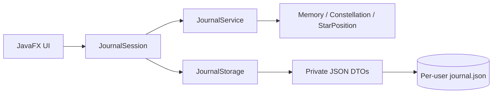

# Constella Developer Guide

## Current design

Constella is a Gradle Java 25 application using JavaFX for its UI and JUnit 5 for tests.

- `constella.ui` owns JavaFX code.
- `constella.application` owns UI-independent application logic and content.
- `constella.model` contains UI-independent domain models.
- `constella.persistence` is reserved for local persistence abstractions and implementations.

The immutable `Memory` model represents one journal memory. It generates or accepts a stable UUID, validates mandatory values, normalizes text, exposes optional description and location values, and returns immutable tag and people sets. UUID defines identity and therefore equality and hash-code behavior. Duplicate tags and people are coalesced after normalization while preserving first-occurrence order.

The JavaFX editor and details panel use this model through the application layer; serialization concerns remain outside it. Constella uses composition rather than artificial memory subclasses: mood, tags, people, location, and constellation membership are independent values that can coexist on any memory. This retains one coherent identity type. `JournalStorage` supplies the polymorphic persistence seam, `JsonJournalStorage` implements it, and `JournalSession` coordinates storage with application use cases. The MP1 specification requires iP-level complexity but does not require a three-type domain hierarchy.

### Journal service

`JournalService` is the in-memory application layer for memory CRUD, constellations, membership cleanup, search, filters, and deterministic star positions. A memory may belong to multiple constellations. Deleting a memory removes its memberships; deleting a constellation does not delete its memories.

Search is case-insensitive across title, description, tags, people, and location. Search and populated mood, tag, constellation, and year filters combine using AND semantics. Results are ordered newest first. `JournalSnapshot` is the immutable aggregate boundary passed to and from the implemented storage layer.

`StarPosition` remains in snapshots and JSON for backward compatibility with the former 2D renderer. Missing saved positions receive the same deterministic UUID fallback, so older files remain readable without a format migration. The current force-directed 3D renderer calculates transient `Vector3` coordinates and neither reads nor writes those legacy 2D positions. My Sky does not provide manual node positioning.

### First-run seeding

`DemoJournalSeeder` builds a deterministic fictional NUS journal containing 24 memories and 5 constellations. Three memories deliberately belong to no constellation so graph layouts demonstrate disconnected content without inventing graph-only data. `JournalSession.loadOrSeed` invokes the seeder only when `JournalStorage.exists()` is false, saves the snapshot immediately, and otherwise loads the existing file unchanged. Clearing calls `JournalService.clear()` and saves an empty snapshot; because the file now exists, later launches do not reseed. This file-existence distinction avoids requiring demo metadata in the persisted format.

### Persistence

`JournalStorage` is the aggregate storage seam. `JsonJournalStorage` maps domain objects to private saved-data records and writes human-readable UTF-8 JSON with Gson 2.14.0. Gson is the only application dependency added for JSON and was selected as a maintained, small-purpose library.

Data is stored at a per-user path (`Application Support` on macOS, `APPDATA` on Windows, and `XDG_DATA_HOME` or `.local/share` on Linux). Missing files load as an empty journal. Loads reconstruct and validate domain objects, remove stale memberships, and reject malformed or unsupported data with contextual errors. Saves validate an existing file first so malformed data is not silently overwritten, then write a same-directory temporary file and atomically replace the target when supported.

### JavaFX application shell

`ConstellaApplication` loads a `JournalSession`, which coordinates service mutations with storage. `ConstellaView` owns navigation, memory selection, details, and CRUD interactions. `MemoryEditorDialog` collects input in a two-column grid with a fixed 130 px label column. Its constellation picker has a viewport sized for up to seven 32 px rows without scrolling. Each custom cell has an explicit checkbox and styled name label, backed by UUID-keyed boolean properties so selection survives filtering and cell reuse. Cells unbind their prior property before rebinding. Primary-clicking any non-checkbox portion of a row toggles its property; checkbox-origin clicks are detected through node ancestry and left to the checkbox to avoid double toggles. Focused rows support Space/Enter and expose accessible text. `ConstellationSearch` provides UI-independent case-insensitive name matching. `MemoryDraft` converts comma-separated fields into the validated domain model. Invalid values remain in the editor with a readable message; deletes require confirmation; storage failures are shown without stack traces.

Visual styling is kept in `constella.css`. The application shell now constructs `Space3DView` as the sole My Sky renderer and initial route; it no longer constructs or exposes the former 2D `SkyView`. The separate 3D Space navigation entry was removed. Existing normalized star-position data remains readable for persistence compatibility but is not used by the force-directed 3D renderer.

The constellation screen creates, renames, and deletes constellations and toggles multi-membership. All changes use `JournalSession` and are persisted immediately.

### JavaFX 3D My Sky

`Space3DView` is the My Sky startup renderer. It uses a depth-buffered `SubScene`, `PerspectiveCamera`, mood-coloured memory `Sphere` nodes, hairline memory-edge `Cylinder` geometry, `PhongMaterial`, and restrained ambient/key lighting. Constellations receive a deterministic palette; an edge uses its contributing constellation's colour, or a deterministic average when overlapping constellations contribute the same edge. A normal transparent `Pane` carries screen-facing labels and fallback guidance so text is not placed in perspective space. Sphere events are consumed separately from background camera events, preventing selection from starting rotation. Connection visibility affects rendering only; auto-rotation defaults on, remains user-toggleable, and explicit +/- zoom reuses the bounded `CameraState`. Pitch, zoom, and pan are clamped, while yaw normalizes across ±180° so continuous rotation cannot become stuck at a boundary. Camera movement is never persisted.

The space ambience uses 96 deterministic low-division background spheres and one small travelling light per real graph edge. A single `AnimationTimer`, throttled to approximately 30 updates per second, changes only opacity, scale, and traveller translation; it never rebuilds geometry or advances the force solver. `SpaceMotion` owns the UI-independent deterministic phase, bounded pulse, edge progress, and interpolation calculations. `GraphFocusVisibility` is the single UI-independent predicate used by static cylinders, travellers, and connection-toggle restoration: no focus shows all edges, constellation focus shows only edges carrying that constellation ID, and memory focus takes precedence to show only incident edges. Auto-rotation updates transforms directly and projects a focused 2D label at approximately 15 Hz; it does not enqueue a `Platform.runLater` operation per frame. The Motion control and view navigation explicitly stop the animation timer; the finite JavaFX settle transition is stopped before each rebuild.

The 3D focus selector uses transient UI options rather than synthetic domain constellations. Its first option represents all memories; the remaining options wrap real constellations. Changing constellation focus clears hover and memory selection before applying constellation highlighting, preventing stale selection precedence from masking the requested focus.

`TimelineView` renders the already-filtered, newest-first memories as compact alternating cards around a central axis with year markers. Rows and cards have bounded heights so a short result set cannot stretch entries to fill the viewport. It is a JavaFX projection only and does not introduce timeline state into the domain or persistence schema.

The renderer depends on six UI-independent responsibilities:

- `MemoryGraphBuilder` is the sole graph-construction authority: visible constellation members are ordered by date then UUID, consecutive memories form sparse paths, and overlapping endpoint pairs are deduplicated while retaining contributing constellation IDs.
- `MemoryGraphRenderPlan` exposes exactly one render node per visible graph memory and exactly the builder's edges, rejecting invalid endpoints. No metadata projection exists.
- `ForceDirected3DLayout` starts from memory UUID-derived coordinates and runs a fixed, early-stopping simulation with memory repulsion, attraction only along `MemoryGraphEdge`s, collision separation, weak centre/component gravity, velocity damping/capping, and X/Y/Z bounds. Disconnected memories receive deterministic weak anchors. Settled positions are recalculated and never written to JSON or applied to My Sky.
- `Vector3` and `ConnectionGeometry` provide finite vector, midpoint, cylinder-length, and Y-axis orientation calculations, including a stable zero-length result.
- `CameraState` bounds pitch, yaw, distance, and pan and provides reset/focus behavior independently of JavaFX events.
- `GraphSelectionState` defines hover-over-selection precedence independently of JavaFX picking; the renderer only maps sphere events into that state.

Geometry is rebuilt only when journal/filter content changes and receives one bounded 320 ms settle-scale animation. Hover, selection, constellation focus, and camera movement update retained nodes and transforms. Selection hides every non-incident edge; constellation focus hides every edge that lacks the selected constellation's retained contributing ID. Unrelated nodes remain at low opacity as spatial context. Labels are projected into the 2D overlay for the hovered/selected memory. Existing `JournalFilter` results feed this view, preserving the shared AND semantics. `ConditionalFeature.SCENE3D` and initialization failure handling provide a local fallback without affecting other views.

### Search, filters, and timeline

My Sky and Timeline share one `JournalFilter` state. Search performs a case-insensitive substring match across title, description, tags, people, and location. Populated mood, exact normalized tag, constellation, and year categories combine with search using AND semantics. Reset clears every category.

The service returns newest-first results, which the timeline presents as keyboard-selectable date/title/summary cards. Selecting one opens the same detail panel used by stars. Both views distinguish an empty journal from filters with no matches.

## Coding standard and assertions

Gradle's Checkstyle integration runs on both production and JUnit sources as part of `./gradlew check`. The repository-owned configuration checks indentation, imports, identifiers, braces, whitespace, line length, empty blocks, and several common readability errors without suppressing whole source trees. It is intentionally a focused baseline standard rather than a formatter substitute.

Java assertions are limited to internal, non-recoverable algorithm invariants. Graph construction asserts that retained edges have endpoints in the graph, and the force layout asserts that settled coordinates are finite and within its published bounds. User input, data-file failures, and runtime capability failures remain validated with exceptions or user-facing error handling because assertions can be disabled.

## Software engineering process

Constella was developed in numbered, testable increments rather than as one generated code dump. Each increment recorded its original prompt, assumptions, changed files, actual commands, verification results, limitations, and a student-review checklist under `logs/`. The sequence progressed through project scaffolding, domain modelling, application services, persistence, JavaFX CRUD, visualization, search and timeline, release preparation, demo data, 3D interaction, and final hardening.

The working process for each increment was:

1. Inspect the current implementation and state assumptions.
2. Propose and implement one coherent change.
3. Add UI-independent tests for domain, application, persistence, geometry, or state logic.
4. Run focused tests followed by the complete verification suite.
5. Manually inspect JavaFX behavior that could not be tested without a graphical environment.
6. Update user and developer documentation to match the verified release.
7. Record failures and corrections in the corresponding interaction log.

The `master` branch is the submission branch. GitHub Actions uses a Linux/Windows/macOS matrix on pushes, pull requests, and manual runs. Every Java 25 job validates the Gradle Wrapper, runs `./gradlew clean check releaseJar --no-daemon`, and uploads the single bundled `Constella.jar` as a seven-day workflow artifact. The workflow has read-only repository permissions and does not deploy or create a GitHub Release. Checkstyle and JUnit form the automated quality gate; the matrix verifies platform compilation and UI-independent behavior, while the User Guide retains the manual GUI checks that headless hosted runners cannot perform.

## Build and test

- macOS/Linux: `./gradlew clean build`
- Windows: `gradlew.bat clean build`
- Tests only: `./gradlew test` or `gradlew.bat test`
- Full verification: `./gradlew clean check` or `gradlew.bat clean check`
- Platform release: `./gradlew releaseJar` or `gradlew.bat releaseJar`
- Run: `./gradlew run` or `gradlew.bat run`

The Gradle Wrapper downloads the pinned Gradle version. The build requests a Java 25 toolchain and can provision one through the Foojay resolver when it is not installed locally.

## Testing approach

Tests exercise domain validation, service CRUD and cleanup, combined search/filter semantics, constellation search, deterministic graph connections, 3D camera bounds, vector/connection geometry, exact memory-only render-plan invariants, sparse/deduplicated overlapping edges, deterministic bounded force layout, collision/depth/component behavior, backward-compatible coordinate loading, application-session saves, cross-platform paths, and JSON failures/round trips without starting JavaFX or touching real user data. Persistence tests use JUnit temporary directories. A 100-memory graph/layout case guards performance and boundedness. UI presentation and full pointer/keyboard flows use the User Guide checklist.

## Error handling

Domain boundaries throw specific validation errors with field-oriented messages. Missing entities use `NoSuchElementException`. Persistence wraps parse/I/O failures in `JournalStorageException` with the affected path and preserves malformed files. JavaFX dialogs translate these failures into readable alerts and never expose stack traces.

## Build and packaging

The application runs through the Gradle Wrapper and Java 25 toolchain. `releaseJar` expands the runtime classpath into `Constella.jar` and uses the plain `constella.Launcher` entry point. Three isolated Gradle configurations add the JavaFX native artifacts for Windows x86-64, Linux x86-64, and Apple Silicon macOS without variant conflicts. Reproducible file ordering, normalized timestamps, and repository line-ending rules keep the output stable across build hosts. The customized `clean` task removes only `release/Constella.jar`, ensuring that `clean check releaseJar` rebuilds the submitted binary while preserving its tracked checksum file. The fat JAR currently emits JavaFX's warning about classes loaded from the unnamed module but launched successfully on Apple Silicon macOS. CI success proves compilation and automated behavior on its runners, not interactive rendering on an end-user desktop.

## Known limitations

- The bounded force layout uses collision separation, but dense graphs can still have visually close nodes; it is a finite settled calculation, not a permanently running simulation.
- Connection lines form a stable path, not a custom graph editable by the user.
- The 3D force layout is settled rather than continuously adaptive; labels are capped to limit overlap, and camera state is intentionally transient.
- There is no undo, import/export, attachment, cloud, authentication, or network functionality.

## Acknowledgements

- OpenAI Codex assisted with requirements analysis, design alternatives, implementation, tests, debugging, documentation, and interaction summaries. The prompts, outcomes, mistakes, and verification are recorded under `logs/`; generated work was reviewed and tested rather than accepted solely on model output.
- Obsidian's graph-view concept inspired the idea of exploring connected journal entries spatially. No Obsidian code, branding, icons, screenshots, or other assets are included.
- Gradle, JavaFX, JUnit, and Checkstyle documentation informed the build, UI, testing, and coding-standard setup.
- JavaFX `SubScene`, camera, shape, material, lighting, and animation API concepts informed the 3D renderer; no external 3D code or assets were reused.
- Gson 2.14.0 provides JSON parsing and generation under the Apache 2.0 license.
- The fictional NUS demo journal was written for this project. No personal journal data, external fonts, or visual assets are included.
